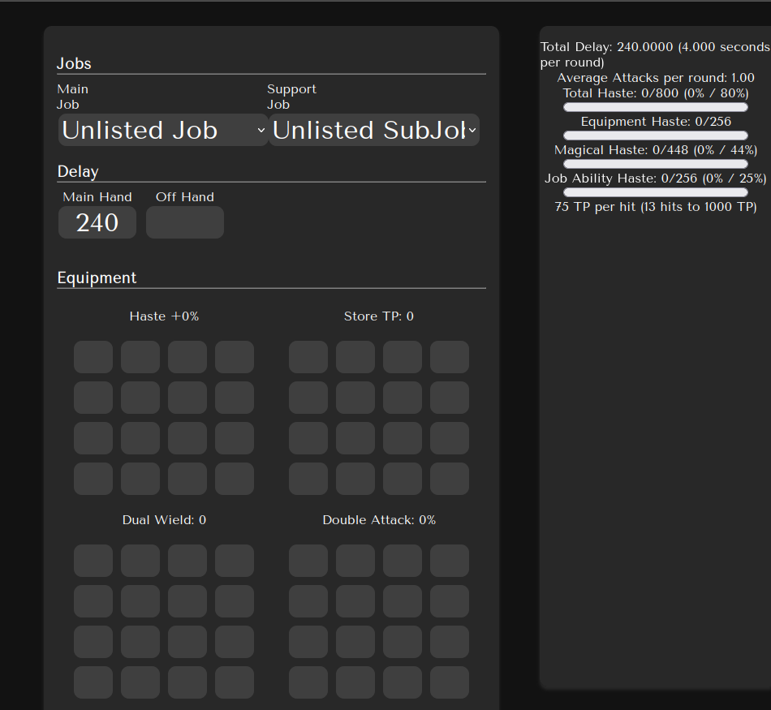
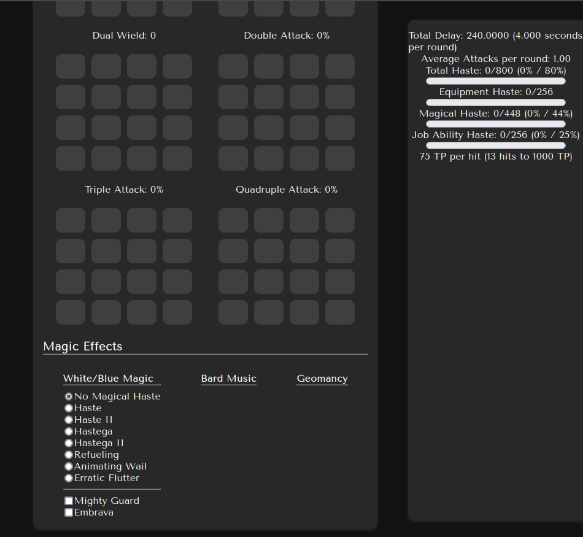

# Magian Calc

  

## Background

Final Fantasy XI online (FFXI) is a 21-year old game with a complicated equipment system. This level of complication necessitates tools to calculate the outcome of wearing certain pieces of gear.  
The most important stat to calculate is Haste. Haste determines the speed of your attacks and is directly linked to every facet of combat.  
This project will calculate Attack Speed and multi-hit to give a heuristic analysis of a player's TP (Technical point) generation over time. This information can be used to improve a player's effectiveness in a group.

There is an existing tool to calculate this information, XICalc, but it only supports the windows operating system. With the growth in the linux gaming community at large, as well as users who play FFXI specifically on linux, tools that run in the browser are becoming more important.

## Functionality and MVPs

With this calculator tool, users will be able to:
- Calculate their expected attack delay based on their job and weapon delay
- Determine their expected TP/hit
- Determine the expected number of attack rounds to reach 1000 TP (an important breakpoint)
- Determine how many seconds it will take to reach 1000 TP

In addition, this project will include:
- A vanilla JS state manager and component framework
- A basic "low-hanging fruit" analysis of areas where performance could be improved
- An "about" modal explaining the purpose of the tool
- A production README
- A "[material theme](https://material-theme.com/)" UI with light and dark modes. 
- Sample loadouts to showcase the information being supplied

## Technologies, Libraries, and APIs

This project will be implemented with the following tools:
- Core HTML visualization elements
- Webpack and Babel for transpilation and bundling
- NPM to manage project dependencies
- [Jasmine](https://jasmine.github.io) for testing
- [Trello](https://trello.com/b/V5stLJ8s/calc) for project management

## Implementation Timeline
This timeline is a best-guess approximation of how long everything should take to complete.
- Thursday Evening: finish final proposal and perform project setup
- Friday Afternoon + Weekend
  - Friday Afternoon: Write unit tests for the state manager
  - Weekend: Implement the state manager and component framework
- Monday
    - Before lunch: write tests for the calculation methods
    - After lunch: create the equipment grid component
- Tuesday
    - Before lunch: implement the feedback sidebar component
    - After lunch: start CSS
- Wednesday: 
    - Before lunch: complete the CSS
    - After lunch: perform manual end-to-end testing of the user interface
- Thursday:
    - Before lunch: setup github pages
    - After Lunch: present the finished product

## Wireframe  

## Assets
  
The above favicon is an edited version of the "[app payment symbol](https://iconduck.com/icons/176682/app-payment-symbol)" provided by Iconduck under the MIT license.